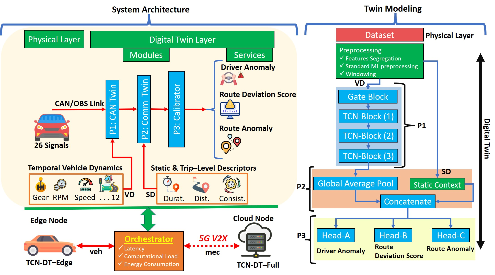
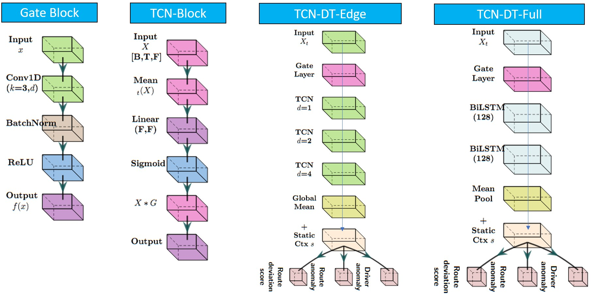
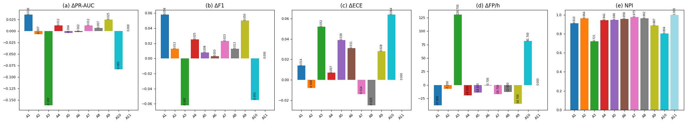

# 🚗 Edge-Aware Digital Twin for Real-Time Driver Behavior and Route Anomaly Prediction under 5G–V2X Constraints

> **Official Kaggle Implementation and Results Repository**  
> _Edge-Aware Digital Twin for Real-Time Driver Behavior and Route Anomaly Prediction under 5G–V2X Constraints_  

---

## 📘 Overview

This repository contains complete **Kaggle-executed experiments**, **graphs**, **trained models**, and **deployment metrics** for the DBRA24 dataset.  
The project integrates **CAN bus analytics**, **V2X link context**, and **edge deployment profiling** into a unified **Digital Twin (DT)** framework for real-time driver behavior and route anomaly detection.

---

## 📊 Dataset: [DBRA24 – Driver Behavior and Route Anomaly Detection](https://www.kaggle.com/datasets/datasetengineer/driver-behavior-and-route-anomaly-dataset-dbra24)

- **Records:** 120,000  
- **Features:** 26  
- **Location:** California  
- **Collected:** January 2023  
- **Applications:** Driver behavior analysis, route anomaly detection, and fleet optimization  

---

## 🧠 Digital Twin Components

| Module | Description | Framework |
|---------|--------------|------------|
| **CAN–Twin** | Learns temporal CAN traffic patterns (speed, RPM, braking) | TCN-Lite / Transformer-Tiny |
| **Comm–Twin** | Models 5G NR–V2X link context (latency, loss, bitrate, AoI) | Simulated / ETSI MEC-030 |
| **Calibrator** | V2X-conditioned reliability mapping (ECE, NLL optimization) | PyTorch MLP |
| **Orchestrator** | Schedules MEC vs edge inference with adaptive timing | TensorRT / ONNX Runtime |

This repository contains:
- Full TCN–DT model
- Ablation variants (A1–A11)
- Training & evaluation pipelines
- Deployment-ready MEC/edge model (“TCN–DT–Edge”)
- Results, trained models & graphs

---

## 📊 Key Results

### **Table 1 — Detection, Calibration & Event Responsiveness (DBRA24)**
(Formatted from paper)

| Model | PR‑AUC_yA | F1_yA | PR‑AUC_yB | RMSE_yC | ECE_yC | TTD (s) | FP/h |
|------|-----------|-------|-----------|---------|--------|----------|------|
| A1 – GBM (Static) | **0.983** | **0.959** | **0.985** | **0.033** | 0.064 | **0.16** | 30.9 |
| A2 – TCN–DT–Context | 0.954 | 0.914 | 0.955 | 0.066 | 0.042 | 0.36 | 61.6 |
| A3 – TCN–DT–NoGate | 0.785 | 0.839 | 0.790 | 0.062 | 0.102 | 0.01 | 199.5 |
| A4 – TCN–DT–Big | 0.959 | 0.926 | 0.958 | 0.065 | 0.057 | 0.37 | 49.3 |
| A5 – TCN–DT–Lag | 0.951 | 0.909 | 0.956 | 0.063 | 0.089 | 0.53 | 54.7 |
| A6 – TCN–DT–ShortSeq | 0.949 | 0.904 | 0.953 | 0.064 | 0.081 | 0.42 | 68.1 |
| A7 – TCN–DT–LagRobust | 0.959 | 0.924 | 0.962 | 0.064 | **0.036** | 0.34 | 52.1 |
| A8 – TCN–DT–MapFree | 0.954 | 0.914 | 0.955 | 0.064 | **0.025** | 0.46 | 56.0 |
| A9 – TCN–DT–Focal | 0.972 | 0.951 | 0.968 | **0.061** | 0.078 | **0.23** | **34.1** |
| A10 – TCN–DT–Edge | 0.864 | 0.846 | 0.862 | 0.066 | 0.114 | 0.32 | 150.5 |
| **A11 – TCN–DT–Full (Proposed)** | 0.947 | 0.901 | 0.945 | 0.064 | **0.050** | 0.45 | 68.8 |

---

### **Table 2 — Efficiency & Orchestration Profiling**

| Model / Ablation      | p50 Lat. (ms) | p95 Lat. (ms) | p99 Lat. (ms) | Throughput (win/s) | FLOPs (M) | Params (M) | Energy (J) |
|-----------------------|---------------|---------------|---------------|---------------------|-----------|------------|------------|
| A1 – GBM (Static)     | 32.38         | 33.76         | 36.05         | **15682.7**         | **0.001** | 0.012      | **1.46**   |
| A2 – TCN-DT–Context   | 8.32          | 8.39          | 8.42          | 7698.2              | 130.0     | 2.16       | 0.0184     |
| A3 – TCN-DT–NoGate    | 8.32          | 8.40          | 8.42          | 7690.2              | 130.0     | 2.16       | 0.0187     |
| A4 – TCN-DT–Big       | **59.66**     | **61.01**     | **65.85**     | **1067.7**          | 1821.0    | 0.031      | **0.061**  |
| A5 – TCN-DT–Lag       | 8.35          | 8.51          | 8.64          | 7685.3              | 130.0     | 2.16       | 0.0188     |
| A6 – TCN-DT–ShortSeq  | 8.34          | 8.42          | 8.44          | 7681.6              | 130.0     | 2.16       | 0.0189     |
| A7 – TCN-DT–LagRobust | 8.32          | 8.40          | 8.44          | 7689.8              | 130.0     | 2.16       | 0.0190     |
| A8 – TCN-DT–MapFree   | 8.31          | 8.38          | 8.44          | 7706.9              | 130.0     | 2.16       | 0.0191     |
| A9 – TCN-DT–Focal     | 8.35          | 8.41          | 8.43          | 7668.8              | 130.0     | 2.16       | 0.0192     |
| A10 – TCN-DT–Edge     | **8.36**      | **8.46**      | **8.50**      | 7651.6              | 130.0     | 2.16       | **0.0190** |
| **A11 – TCN-DT–Full** | 8.32          | 8.40          | 8.46          | 7690.4              | 130.0     | 2.16       | 0.0193     |

---

### **Table 3 — Ablation Mapping**
| ID  | Variant               | Objective / Modification                       | Active Modules | Primary Phase Under Test              |
|-----|------------------------|------------------------------------------------|----------------|----------------------------------------|
| A1  | GBM (Static Baseline) | Non-sequential baseline; no temporal or link awareness. | –              | Static benchmark for comparison        |
| A2  | TCN–DT–Context        | Removes environment context.                   | P1, P3–P4      | P1 – physical model isolation          |
| A3  | TCN–DT–NoGate         | Disables reliability gates / noise.            | P1–P3          | P3 – calibration stress                |
| A4  | TCN–DT–Big            | Enlarged network (no energy limit).            | P1, P4         | P4 – latency/efficiency trade-off      |
| A5  | TCN–DT–Lag            | Adds 100–300 ms stream offset.                 | P1–P4          | P2 – comm alignment sensitivity        |
| A6  | TCN–DT–ShortSeq       | Shorter temporal window (20 s).                | P1–P4          | P1 – temporal window impact            |
| A7  | TCN–DT–LagRobust      | Jitter-augmented training.                     | P1–P4          | P1–P2 – sync robustness                |
| A8  | TCN–DT–MapFree        | Removes map/geofencing inputs.                 | P1, P3–P4      | P3 – spatial calibration check         |
| A9  | TCN–DT–Focal          | Focal loss for class imbalance.                | P3–P4          | P3 – reliability optimization          |
| A10 | TCN–DT–Edge           | Distilled variant for MEC deployment.          | P1, P4         | P4 – edge deployability optimization   |
| A11 | **TCN–DT–Full (Proposed)** | **All modules active; complete DT.**     | **P1–P4**      | **Full system integration**            |

---

## 🧠 Architecture

### **Proposed Model Architectures (a) Gate Layer that applies feature-wise modulation to the input sequence.  (b) TCN Block illustrates the temporal convolution block used to extract short-range motion patterns.  (c) TCN Edge presents the TCN-DT-Edge model, which stacks dilated convolutions and combines the output with static context for on-vehicle inference.  (d) TCN DT Full model, where BiLSTM layers replace the TCN stack to support cloud-level processing.**

### **Performance variations in PR-AUC, F1, ECE, FP/h, and the proposed NPI metric across all proposed ablations.**

---
---

## 🖼️ DBRA24 Feature Distributions

Below are the feature-wise distributions generated from the Kaggle notebook (`1-dbra24-visualization.ipynb`).  
These show variability across trips and drivers.

| Feature | Visualization |
|----------|----------------|
| Acceleration |  |
| Acceleration Variation |  |
| Anomalous Events |  |
| Behavioral Consistency |  |
| Brake Usage |  |
| Driver ID |  |
| Fuel Consumption |  |
| Geofencing Violations |  |
| Heading |  |
| Lane Deviation |  |
| Latitude |  |
| Longitude |  |
| Route Anomaly |  |
| Route Deviation Score |  |
| RPM |  |
| Speed |  |
| Steering Angle |  |
| Stop Events |  |
| Trip Distance |  |
| Trip Duration |  |
| Trip ID |  |
| Vehicle ID |  |

---

---

## 🧑‍💻 Authors

| Name | Affiliation | Role / Membership | Email |
|------|-------------|-------------------|--------|
| **Ajmal Khan** | IMSIU | Member, IEEE | ajmal@imamu.edu.sa |
| **Misha Urooj Khan** | CERN | Researcher | misha.urooj.khan@cern.ch |
| **Ahmad Suleman** | CRD | Research Scientist | ahmad.suleman@crd.org |
| **Zeeshan Kaleem** | KFUPM | Senior Member, IEEE | zkaleem@kfupm.edu.sa |
| **Naveed Iqbal** | Qatar University | Senior Member, IEEE | naveed.iqbal@qu.edu.qa |
| **M. Bait Suwailem** | KACST | Member, IEEE | bait.suwailem@kacst.edu.sa |
| **Dusit Niyato** | NTU Singapore | Fellow, IEEE | dniyato@ntu.edu.sg |

---

## 🧩 Acknowledgment

This work was executed on **Kaggle Tesla T4 GPUs** under the **DigitalTwin-Fault Project**.  
Supported by the **Deanship of Scientific Research, Imam Mohammad Ibn Saud Islamic University (IMSIU)** — Grant **IMSIU-DDRSP2504**.

---

## 📜 License

- **Code**: MIT License  
- **Dataset**: [Kaggle DBRA24 Terms of Use](https://www.kaggle.com/datasets/datasetengineer/driver-behavior-and-route-anomaly-dataset-dbra24)

---
